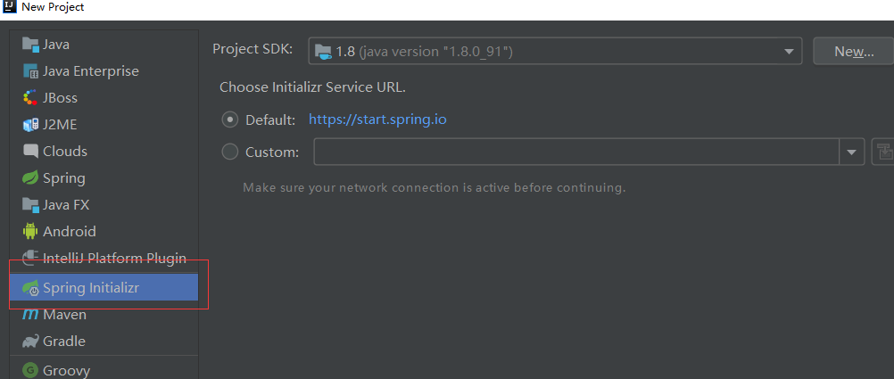

学习不走弯路，[关注公众号](#公众号) 回复「学习路线」，获取mall项目专属学习路线！

# mall整合SpringBoot+MyBatis搭建基本骨架

> 本文主要讲解mall整合SpringBoot+MyBatis搭建基本骨架，以商品品牌为例实现基本的CRUD操作及通过PageHelper实现分页查询。

## mysql数据库环境搭建

- 下载并安装mysql5.7版本，下载地址：https://dev.mysql.com/downloads/installer/
- 设置数据库帐号密码：root root
- 下载并安装客户端连接工具Navicat,下载地址：http://www.formysql.com/xiazai.html
- 创建数据库mall
- 导入mall的数据库脚本，脚本地址：https://github.com/macrozheng/mall-learning/blob/master/document/sql/mall.sql

## 项目使用框架介绍

### SpringBoot

> SpringBoot可以让你快速构建基于Spring的Web应用程序，内置多种Web容器(如Tomcat)，通过启动入口程序的main函数即可运行。

### PagerHelper

> MyBatis分页插件，简单的几行代码就能实现分页，在与SpringBoot整合时，只要整合了PagerHelper就自动整合了MyBatis。

```java
PageHelper.startPage(pageNum, pageSize);
//之后进行查询操作将自动进行分页
List<PmsBrand> brandList = brandMapper.selectByExample(new PmsBrandExample());
//通过构造PageInfo对象获取分页信息，如当前页码，总页数，总条数
PageInfo<PmsBrand> pageInfo = new PageInfo<PmsBrand>(list);
```

### Druid
> alibaba开源的数据库连接池，号称Java语言中最好的数据库连接池。

### Mybatis generator

> MyBatis的代码生成器，可以根据数据库生成model、mapper.xml、mapper接口和Example，通常情况下的单表查询不用再手写mapper。

## 项目搭建

### 使用IDEA初始化一个SpringBoot项目



### 添加项目依赖
> 在pom.xml中添加相关依赖。

```xml
<parent>
        <groupId>org.springframework.boot</groupId>
        <artifactId>spring-boot-starter-parent</artifactId>
        <version>2.1.3.RELEASE</version>
        <relativePath/> <!-- lookup parent from repository -->
    </parent>
    <dependencies>
        <!--SpringBoot通用依赖模块-->
        <dependency>
            <groupId>org.springframework.boot</groupId>
            <artifactId>spring-boot-starter-web</artifactId>
        </dependency>
        <dependency>
            <groupId>org.springframework.boot</groupId>
            <artifactId>spring-boot-starter-actuator</artifactId>
        </dependency>
        <dependency>
            <groupId>org.springframework.boot</groupId>
            <artifactId>spring-boot-starter-aop</artifactId>
        </dependency>
        <dependency>
            <groupId>org.springframework.boot</groupId>
            <artifactId>spring-boot-starter-test</artifactId>
            <scope>test</scope>
        </dependency>
        <!--MyBatis分页插件-->
        <dependency>
            <groupId>com.github.pagehelper</groupId>
            <artifactId>pagehelper-spring-boot-starter</artifactId>
            <version>1.2.10</version>
        </dependency>
        <!--集成druid连接池-->
        <dependency>
            <groupId>com.alibaba</groupId>
            <artifactId>druid-spring-boot-starter</artifactId>
            <version>1.1.10</version>
        </dependency>
        <!-- MyBatis 生成器 -->
        <dependency>
            <groupId>org.mybatis.generator</groupId>
            <artifactId>mybatis-generator-core</artifactId>
            <version>1.3.3</version>
        </dependency>
        <!--Mysql数据库驱动-->
        <dependency>
            <groupId>mysql</groupId>
            <artifactId>mysql-connector-java</artifactId>
            <version>8.0.15</version>
        </dependency>
    </dependencies>
```
### 修改SpringBoot配置文件
> 在application.yml中添加数据源配置和MyBatis的mapper.xml的路径配置。

```yml
server:
  port: 8080

spring:
  datasource:
    url: jdbc:mysql://localhost:3306/mall?useUnicode=true&characterEncoding=utf-8&serverTimezone=Asia/Shanghai
    username: root
    password: 123456

mybatis:
  mapper-locations:
    - classpath:mapper/*.xml
    - classpath*:com/**/mapper/*.xml
```

### 项目结构说明


### Mybatis generator 配置文件

> 配置数据库连接，Mybatis generator生成model、mapper接口及mapper.xml的路径。

```xml
<?xml version="1.0" encoding="UTF-8"?>
<!DOCTYPE generatorConfiguration
        PUBLIC "-//mybatis.org//DTD MyBatis Generator Configuration 1.0//EN"
        "http://mybatis.org/dtd/mybatis-generator-config_1_0.dtd">

<generatorConfiguration>
    <properties resource="generator.properties"/>
    <context id="MySqlContext" targetRuntime="MyBatis3" defaultModelType="flat">
        <property name="beginningDelimiter" value="`"/>
        <property name="endingDelimiter" value="`"/>
        <property name="javaFileEncoding" value="UTF-8"/>
        <!-- 为模型生成序列化方法-->
        <plugin type="org.mybatis.generator.plugins.SerializablePlugin"/>
        <!-- 为生成的Java模型创建一个toString方法 -->
        <plugin type="org.mybatis.generator.plugins.ToStringPlugin"/>
        <!--可以自定义生成model的代码注释-->
        <commentGenerator type="com.macro.mall.tiny.mbg.CommentGenerator">
            <!-- 是否去除自动生成的注释 true：是 ： false:否 -->
            <property name="suppressAllComments" value="true"/>
            <property name="suppressDate" value="true"/>
            <property name="addRemarkComments" value="true"/>
        </commentGenerator>
        <!--配置数据库连接-->
        <jdbcConnection driverClass="${jdbc.driverClass}"
                        connectionURL="${jdbc.connectionURL}"
                        userId="${jdbc.userId}"
                        password="${jdbc.password}">
            <!--解决mysql驱动升级到8.0后不生成指定数据库代码的问题-->
            <property name="nullCatalogMeansCurrent" value="true" />
        </jdbcConnection>
        <!--指定生成model的路径-->
        <javaModelGenerator targetPackage="com.macro.mall.tiny.mbg.model" targetProject="mall-tiny-01\src\main\java"/>
        <!--指定生成mapper.xml的路径-->
        <sqlMapGenerator targetPackage="com.macro.mall.tiny.mbg.mapper" targetProject="mall-tiny-01\src\main\resources"/>
        <!--指定生成mapper接口的的路径-->
        <javaClientGenerator type="XMLMAPPER" targetPackage="com.macro.mall.tiny.mbg.mapper"
                             targetProject="mall-tiny-01\src\main\java"/>
        <!--生成全部表tableName设为%-->
        <table tableName="pms_brand">
            <generatedKey column="id" sqlStatement="MySql" identity="true"/>
        </table>
    </context>
</generatorConfiguration>
```

### 运行Generator的main函数生成代码

```java
package com.macro.mall.tiny.mbg;

import org.mybatis.generator.api.MyBatisGenerator;
import org.mybatis.generator.config.Configuration;
import org.mybatis.generator.config.xml.ConfigurationParser;
import org.mybatis.generator.internal.DefaultShellCallback;

import java.io.InputStream;
import java.util.ArrayList;
import java.util.List;

/**
 * 用于生产MBG的代码
 * Created by macro on 2018/4/26.
 */
public class Generator {
    public static void main(String[] args) throws Exception {
        //MBG 执行过程中的警告信息
        List<String> warnings = new ArrayList<String>();
        //当生成的代码重复时，覆盖原代码
        boolean overwrite = true;
        //读取我们的 MBG 配置文件
        InputStream is = Generator.class.getResourceAsStream("/generatorConfig.xml");
        ConfigurationParser cp = new ConfigurationParser(warnings);
        Configuration config = cp.parseConfiguration(is);
        is.close();

        DefaultShellCallback callback = new DefaultShellCallback(overwrite);
        //创建 MBG
        MyBatisGenerator myBatisGenerator = new MyBatisGenerator(config, callback, warnings);
        //执行生成代码
        myBatisGenerator.generate(null);
        //输出警告信息
        for (String warning : warnings) {
            System.out.println(warning);
        }
    }
}
```

### 添加MyBatis的Java配置

> 用于配置需要动态生成的mapper接口的路径

```java
package com.macro.mall.tiny.config;

import org.mybatis.spring.annotation.MapperScan;
import org.springframework.context.annotation.Configuration;

/**
 * MyBatis配置类
 * Created by macro on 2019/4/8.
 */
@Configuration
@MapperScan("com.macro.mall.tiny.mbg.mapper")
public class MyBatisConfig {
}

```


### 实现Controller中的接口

> 实现PmsBrand表中的添加、修改、删除及分页查询接口。

```java
package com.macro.mall.tiny.controller;

import com.macro.mall.tiny.common.api.CommonPage;
import com.macro.mall.tiny.common.api.CommonResult;
import com.macro.mall.tiny.mbg.model.PmsBrand;
import com.macro.mall.tiny.service.PmsBrandService;
import org.slf4j.Logger;
import org.slf4j.LoggerFactory;
import org.springframework.beans.factory.annotation.Autowired;
import org.springframework.stereotype.Controller;
import org.springframework.validation.BindingResult;
import org.springframework.web.bind.annotation.*;

import java.util.List;


/**
 * 品牌管理Controller
 * Created by macro on 2019/4/19.
 */
@Controller
@RequestMapping("/brand")
public class PmsBrandController {
    @Autowired
    private PmsBrandService demoService;

    private static final Logger LOGGER = LoggerFactory.getLogger(PmsBrandController.class);

    @RequestMapping(value = "listAll", method = RequestMethod.GET)
    @ResponseBody
    public CommonResult<List<PmsBrand>> getBrandList() {
        return CommonResult.success(demoService.listAllBrand());
    }

    @RequestMapping(value = "/create", method = RequestMethod.POST)
    @ResponseBody
    public CommonResult createBrand(@RequestBody PmsBrand pmsBrand) {
        CommonResult commonResult;
        int count = demoService.createBrand(pmsBrand);
        if (count == 1) {
            commonResult = CommonResult.success(pmsBrand);
            LOGGER.debug("createBrand success:{}", pmsBrand);
        } else {
            commonResult = CommonResult.failed("操作失败");
            LOGGER.debug("createBrand failed:{}", pmsBrand);
        }
        return commonResult;
    }

    @RequestMapping(value = "/update/{id}", method = RequestMethod.POST)
    @ResponseBody
    public CommonResult updateBrand(@PathVariable("id") Long id, @RequestBody PmsBrand pmsBrandDto, BindingResult result) {
        CommonResult commonResult;
        int count = demoService.updateBrand(id, pmsBrandDto);
        if (count == 1) {
            commonResult = CommonResult.success(pmsBrandDto);
            LOGGER.debug("updateBrand success:{}", pmsBrandDto);
        } else {
            commonResult = CommonResult.failed("操作失败");
            LOGGER.debug("updateBrand failed:{}", pmsBrandDto);
        }
        return commonResult;
    }

    @RequestMapping(value = "/delete/{id}", method = RequestMethod.GET)
    @ResponseBody
    public CommonResult deleteBrand(@PathVariable("id") Long id) {
        int count = demoService.deleteBrand(id);
        if (count == 1) {
            LOGGER.debug("deleteBrand success :id={}", id);
            return CommonResult.success(null);
        } else {
            LOGGER.debug("deleteBrand failed :id={}", id);
            return CommonResult.failed("操作失败");
        }
    }

    @RequestMapping(value = "/list", method = RequestMethod.GET)
    @ResponseBody
    public CommonResult<CommonPage<PmsBrand>> listBrand(@RequestParam(value = "pageNum", defaultValue = "1") Integer pageNum,
                                                        @RequestParam(value = "pageSize", defaultValue = "3") Integer pageSize) {
        List<PmsBrand> brandList = demoService.listBrand(pageNum, pageSize);
        return CommonResult.success(CommonPage.restPage(brandList));
    }

    @RequestMapping(value = "/{id}", method = RequestMethod.GET)
    @ResponseBody
    public CommonResult<PmsBrand> brand(@PathVariable("id") Long id) {
        return CommonResult.success(demoService.getBrand(id));
    }
}

```
### 添加Service接口
```java
package com.macro.mall.tiny.service;


import com.macro.mall.tiny.mbg.model.PmsBrand;

import java.util.List;

/**
 * PmsBrandService
 * Created by macro on 2019/4/19.
 */
public interface PmsBrandService {
    List<PmsBrand> listAllBrand();

    int createBrand(PmsBrand brand);

    int updateBrand(Long id, PmsBrand brand);

    int deleteBrand(Long id);

    List<PmsBrand> listBrand(int pageNum, int pageSize);

    PmsBrand getBrand(Long id);
}

```
### 实现Service接口
```java
package com.macro.mall.tiny.service.impl;

import com.github.pagehelper.PageHelper;
import com.macro.mall.tiny.mbg.mapper.PmsBrandMapper;
import com.macro.mall.tiny.mbg.model.PmsBrand;
import com.macro.mall.tiny.mbg.model.PmsBrandExample;
import com.macro.mall.tiny.service.PmsBrandService;
import org.springframework.beans.factory.annotation.Autowired;
import org.springframework.stereotype.Service;

import java.util.List;

/**
 * PmsBrandService实现类
 * Created by macro on 2019/4/19.
 */
@Service
public class PmsBrandServiceImpl implements PmsBrandService {
    @Autowired
    private PmsBrandMapper brandMapper;

    @Override
    public List<PmsBrand> listAllBrand() {
        return brandMapper.selectByExample(new PmsBrandExample());
    }

    @Override
    public int createBrand(PmsBrand brand) {
        return brandMapper.insertSelective(brand);
    }

    @Override
    public int updateBrand(Long id, PmsBrand brand) {
        brand.setId(id);
        return brandMapper.updateByPrimaryKeySelective(brand);
    }

    @Override
    public int deleteBrand(Long id) {
        return brandMapper.deleteByPrimaryKey(id);
    }

    @Override
    public List<PmsBrand> listBrand(int pageNum, int pageSize) {
        PageHelper.startPage(pageNum, pageSize);
        return brandMapper.selectByExample(new PmsBrandExample());
    }

    @Override
    public PmsBrand getBrand(Long id) {
        return brandMapper.selectByPrimaryKey(id);
    }
}

```

## 项目源码地址
[https://github.com/macrozheng/mall-learning/tree/master/mall-tiny-01](https://github.com/macrozheng/mall-learning/tree/master/mall-tiny-01)

## 公众号


