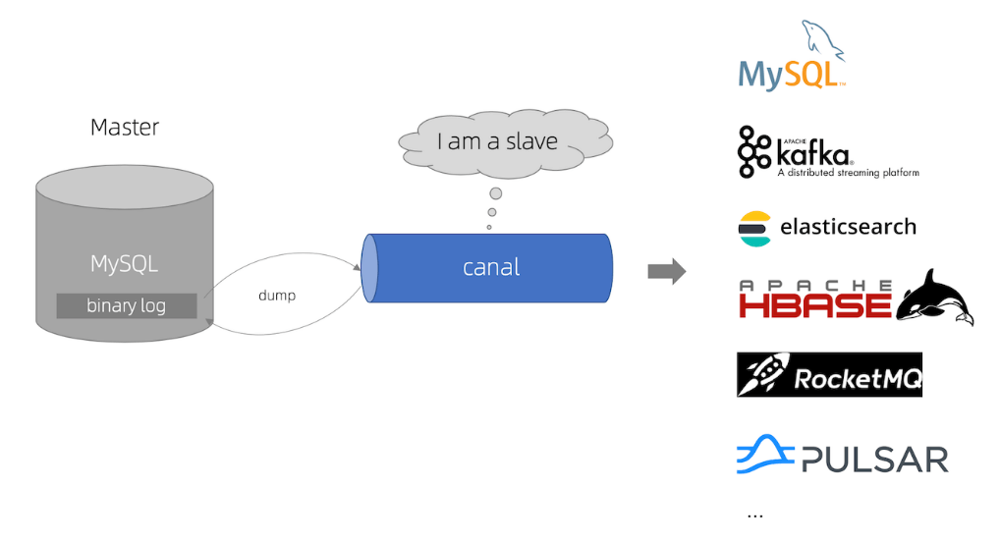
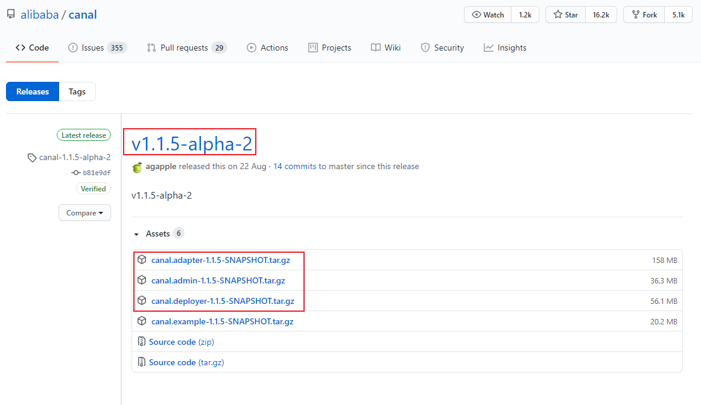
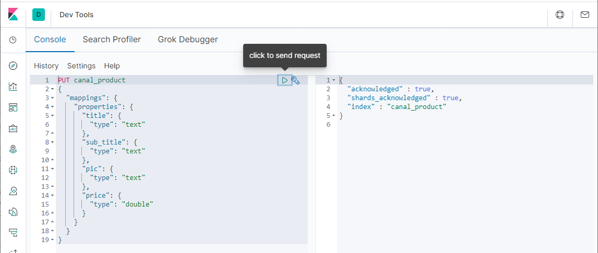
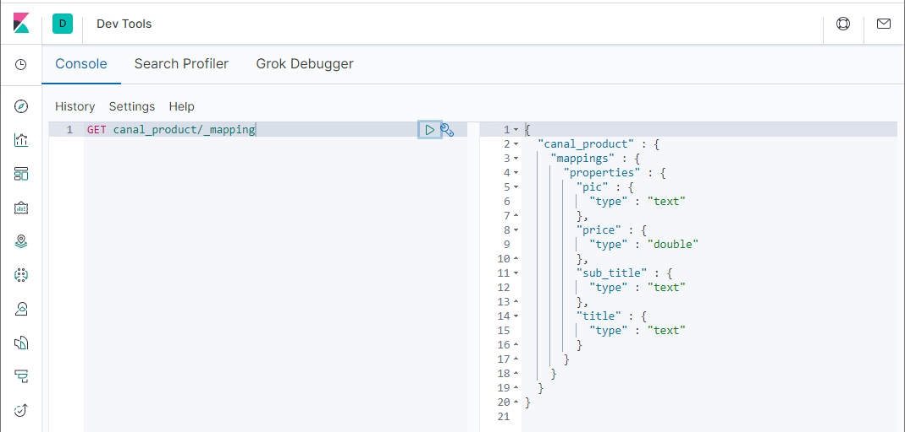
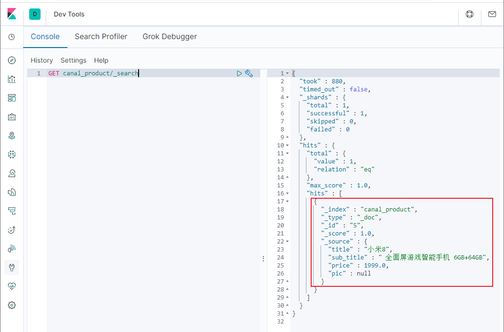
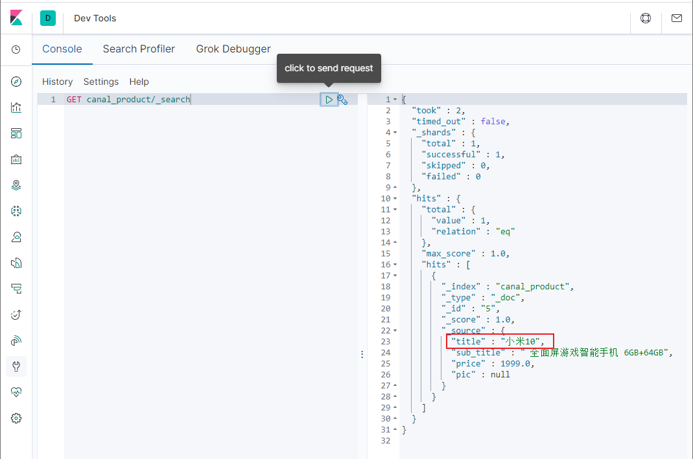
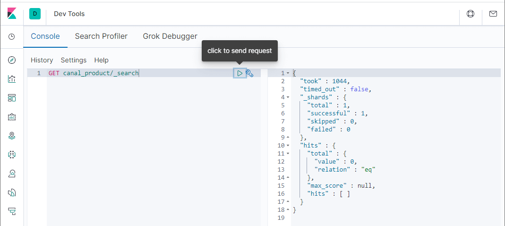
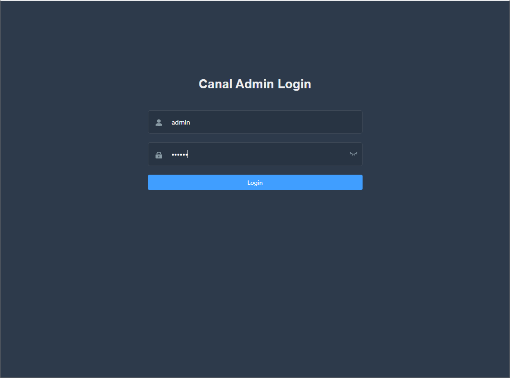
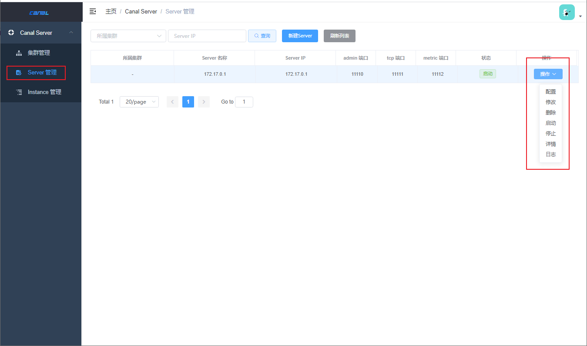

学习不走弯路，[关注公众号](#公众号) 回复「学习路线」，获取mall项目专属学习路线！

# MySQL如何实时同步数据到ES？试试这款阿里开源的神器！

> `mall`项目中的商品搜索功能，一直都没有做实时数据同步。最近发现阿里巴巴开源的`canal`可以把MySQL中的数据实时同步到Elasticsearch中，能很好地解决数据同步问题。今天我们来讲讲`canal`的使用，希望对大家有所帮助！

## canal简介

canal主要用途是对MySQL数据库增量日志进行解析，提供增量数据的订阅和消费，简单说就是可以对MySQL的增量数据进行实时同步，支持同步到MySQL、Elasticsearch、HBase等数据存储中去。

## canal工作原理

canal会模拟MySQL主库和从库的交互协议，从而伪装成MySQL的从库，然后向MySQL主库发送dump协议，MySQL主库收到dump请求会向canal推送binlog，canal通过解析binlog将数据同步到其他存储中去。



## canal使用

> 接下来我们来学习下canal的使用，以MySQL实时同步数据到Elasticsearch为例。

### 组件下载

- 首先我们需要下载canal的各个组件`canal-server`、`canal-adapter`、`canal-admin`，下载地址：https://github.com/alibaba/canal/releases



- canal的各个组件的用途各不相同，下面分别介绍下：
    - canal-server（canal-deploy）：可以直接监听MySQL的binlog，把自己伪装成MySQL的从库，只负责接收数据，并不做处理。
    - canal-adapter：相当于canal的客户端，会从canal-server中获取数据，然后对数据进行同步，可以同步到MySQL、Elasticsearch和HBase等存储中去。
    - canal-admin：为canal提供整体配置管理、节点运维等面向运维的功能，提供相对友好的WebUI操作界面，方便更多用户快速和安全的操作。

- 由于不同版本的MySQL、Elasticsearch和canal会有兼容性问题，所以我们先对其使用版本做个约定。

| 应用          | 端口  | 版本   |
| ------------- | ----- | ------ |
| MySQL         | 3306  | 5.7    |
| Elasticsearch | 9200  | 7.6.2  |
| Kibanba       | 5601  | 7.6.2  |
| canal-server  | 11111 | 1.1.15 |
| canal-adapter | 8081  | 1.1.15 |
| canal-admin   | 8089  | 1.1.15 |

### MySQL配置

- 由于canal是通过订阅MySQL的binlog来实现数据同步的，所以我们需要开启MySQL的binlog写入功能，并设置`binlog-format`为ROW模式，我的配置文件为`/mydata/mysql/conf/my.cnf`，改为如下内容即可；

```bash
[mysqld]
## 设置server_id，同一局域网中需要唯一
server_id=101 
## 指定不需要同步的数据库名称
binlog-ignore-db=mysql  
## 开启二进制日志功能
log-bin=mall-mysql-bin  
## 设置二进制日志使用内存大小（事务）
binlog_cache_size=1M  
## 设置使用的二进制日志格式（mixed,statement,row）
binlog_format=row  
## 二进制日志过期清理时间。默认值为0，表示不自动清理。
expire_logs_days=7  
## 跳过主从复制中遇到的所有错误或指定类型的错误，避免slave端复制中断。
## 如：1062错误是指一些主键重复，1032错误是因为主从数据库数据不一致
slave_skip_errors=1062  
```

- 配置完成后需要重新启动MySQL，重启成功后通过如下命令查看binlog是否启用；

```sql
show variables like '%log_bin%'
```

```
+---------------------------------+-------------------------------------+
| Variable_name                   | Value                               |
+---------------------------------+-------------------------------------+
| log_bin                         | ON                                  |
| log_bin_basename                | /var/lib/mysql/mall-mysql-bin       |
| log_bin_index                   | /var/lib/mysql/mall-mysql-bin.index |
| log_bin_trust_function_creators | OFF                                 |
| log_bin_use_v1_row_events       | OFF                                 |
| sql_log_bin                     | ON                                  |
+---------------------------------+-------------------------------------+
```

- 再查看下MySQL的binlog模式；

```sql
show variables like 'binlog_format%';  
```

```
+---------------+-------+
| Variable_name | Value |
+---------------+-------+
| binlog_format | ROW   |
+---------------+-------+
```

- 接下来需要创建一个拥有从库权限的账号，用于订阅binlog，这里创建的账号为`canal:canal`；

```sql
CREATE USER canal IDENTIFIED BY 'canal';  
GRANT SELECT, REPLICATION SLAVE, REPLICATION CLIENT ON *.* TO 'canal'@'%';
FLUSH PRIVILEGES;
```

- 创建好测试用的数据库`canal-test`，之后创建一张商品表`product`，建表语句如下。

```sql
CREATE TABLE `product`  (
  `id` bigint(20) NOT NULL AUTO_INCREMENT,
  `title` varchar(255) CHARACTER SET utf8 COLLATE utf8_general_ci NULL DEFAULT NULL,
  `sub_title` varchar(255) CHARACTER SET utf8 COLLATE utf8_general_ci NULL DEFAULT NULL,
  `price` decimal(10, 2) NULL DEFAULT NULL,
  `pic` varchar(255) CHARACTER SET utf8 COLLATE utf8_general_ci NULL DEFAULT NULL,
  PRIMARY KEY (`id`) USING BTREE
) ENGINE = InnoDB AUTO_INCREMENT = 2 CHARACTER SET = utf8 COLLATE = utf8_general_ci ROW_FORMAT = Dynamic;
```

### canal-server使用

- 将我们下载好的压缩包`canal.deployer-1.1.5-SNAPSHOT.tar.gz`上传到Linux服务器，然后解压到指定目录`/mydata/canal-server`，可使用如下命令解压；

````bash
tar -zxvf canal.deployer-1.1.5-SNAPSHOT.tar.gz
````

- 解压完成后目录结构如下；

```
├── bin
│   ├── restart.sh
│   ├── startup.bat
│   ├── startup.sh
│   └── stop.sh
├── conf
│   ├── canal_local.properties
│   ├── canal.properties
│   └── example
│       └── instance.properties
├── lib
├── logs
│   ├── canal
│   │   └── canal.log
│   └── example
│       ├── example.log
│       └── example.log
└── plugin
```

- 修改配置文件`conf/example/instance.properties`，按如下配置即可，主要是修改数据库相关配置；

```
# 需要同步数据的MySQL地址
canal.instance.master.address=127.0.0.1:3306
canal.instance.master.journal.name=
canal.instance.master.position=
canal.instance.master.timestamp=
canal.instance.master.gtid=
# 用于同步数据的数据库账号
canal.instance.dbUsername=canal
# 用于同步数据的数据库密码
canal.instance.dbPassword=canal
# 数据库连接编码
canal.instance.connectionCharset = UTF-8
# 需要订阅binlog的表过滤正则表达式
canal.instance.filter.regex=.*\\..*
```

- 使用`startup.sh`脚本启动`canal-server`服务；

```bash
sh bin/startup.sh
```

- 启动成功后可使用如下命令查看服务日志信息；

```bash
tail -f logs/canal/canal.log
```

```bash
2020-10-26 16:18:13.354 [main] INFO  com.alibaba.otter.canal.deployer.CanalController - ## start the canal server[172.17.0.1(172.17.0.1):11111]
2020-10-26 16:18:19.978 [main] INFO  com.alibaba.otter.canal.deployer.CanalStarter - ## the canal server is running now ......
```

- 启动成功后可使用如下命令查看instance日志信息；

```bash
tail -f logs/example/example.log 
```

```bash
2020-10-26 16:18:16.056 [main] INFO  c.a.o.c.i.spring.support.PropertyPlaceholderConfigurer - Loading properties file from class path resource [canal.properties]
2020-10-26 16:18:16.061 [main] INFO  c.a.o.c.i.spring.support.PropertyPlaceholderConfigurer - Loading properties file from class path resource [example/instance.properties]
2020-10-26 16:18:18.259 [main] INFO  c.a.otter.canal.instance.spring.CanalInstanceWithSpring - start CannalInstance for 1-example 
2020-10-26 16:18:18.282 [main] WARN  c.a.o.canal.parse.inbound.mysql.dbsync.LogEventConvert - --> init table filter : ^.*\..*$
2020-10-26 16:18:18.282 [main] WARN  c.a.o.canal.parse.inbound.mysql.dbsync.LogEventConvert - --> init table black filter : ^mysql\.slave_.*$
2020-10-26 16:18:19.543 [destination = example , address = /127.0.0.1:3306 , EventParser] WARN  c.a.o.c.p.inbound.mysql.rds.RdsBinlogEventParserProxy - ---> begin to find start position, it will be long time for reset or first position
2020-10-26 16:18:19.578 [main] INFO  c.a.otter.canal.instance.core.AbstractCanalInstance - start successful....
2020-10-26 16:18:19.912 [destination = example , address = /127.0.0.1:3306 , EventParser] WARN  c.a.o.c.p.inbound.mysql.rds.RdsBinlogEventParserProxy - prepare to find start position just last position
 {"identity":{"slaveId":-1,"sourceAddress":{"address":"localhost","port":3306}},"postion":{"gtid":"","included":false,"journalName":"mall-mysql-bin.000006","position":2271,"serverId":101,"timestamp":1603682664000}}
2020-10-26 16:18:22.435 [destination = example , address = /127.0.0.1:3306 , EventParser] WARN  c.a.o.c.p.inbound.mysql.rds.RdsBinlogEventParserProxy - ---> find start position successfully, EntryPosition[included=false,journalName=mall-mysql-bin.000006,position=2271,serverId=101,gtid=,timestamp=1603682664000] cost : 2768ms , the next step is binlog dump
```

- 如果想要停止`canal-server`服务可以使用如下命令。

```bash
sh bin/stop.sh
```

### canal-adapter使用

- 将我们下载好的压缩包`canal.adapter-1.1.5-SNAPSHOT.tar.gz`上传到Linux服务器，然后解压到指定目录`/mydata/canal-adpter`，解压完成后目录结构如下；

```
├── bin
│   ├── adapter.pid
│   ├── restart.sh
│   ├── startup.bat
│   ├── startup.sh
│   └── stop.sh
├── conf
│   ├── application.yml
│   ├── es6
│   ├── es7
│   │   ├── biz_order.yml
│   │   ├── customer.yml
│   │   └── product.yml
│   ├── hbase
│   ├── kudu
│   ├── logback.xml
│   ├── META-INF
│   │   └── spring.factories
│   └── rdb
├── lib
├── logs
│   └── adapter
│       └── adapter.log
└── plugin
```

- 修改配置文件`conf/application.yml`，按如下配置即可，主要是修改canal-server配置、数据源配置和客户端适配器配置；

```yaml
canal.conf:
  mode: tcp # 客户端的模式，可选tcp kafka rocketMQ
  flatMessage: true # 扁平message开关, 是否以json字符串形式投递数据, 仅在kafka/rocketMQ模式下有效
  zookeeperHosts:    # 对应集群模式下的zk地址
  syncBatchSize: 1000 # 每次同步的批数量
  retries: 0 # 重试次数, -1为无限重试
  timeout: # 同步超时时间, 单位毫秒
  accessKey:
  secretKey:
  consumerProperties:
    # canal tcp consumer
    canal.tcp.server.host: 127.0.0.1:11111 #设置canal-server的地址
    canal.tcp.zookeeper.hosts:
    canal.tcp.batch.size: 500
    canal.tcp.username:
    canal.tcp.password:

  srcDataSources: # 源数据库配置
    defaultDS:
      url: jdbc:mysql://127.0.0.1:3306/canal_test?useUnicode=true
      username: canal
      password: canal
  canalAdapters: # 适配器列表
  - instance: example # canal实例名或者MQ topic名
    groups: # 分组列表
    - groupId: g1 # 分组id, 如果是MQ模式将用到该值
      outerAdapters:
      - name: logger # 日志打印适配器
      - name: es7 # ES同步适配器
        hosts: 127.0.0.1:9200 # ES连接地址
        properties:
          mode: rest # 模式可选transport(9300) 或者 rest(9200)
          # security.auth: test:123456 #  only used for rest mode
          cluster.name: elasticsearch # ES集群名称
```

- 添加配置文件`canal-adapter/conf/es7/product.yml`，用于配置MySQL中的表与Elasticsearch中索引的映射关系；

```yaml
dataSourceKey: defaultDS # 源数据源的key, 对应上面配置的srcDataSources中的值
destination: example  # canal的instance或者MQ的topic
groupId: g1 # 对应MQ模式下的groupId, 只会同步对应groupId的数据
esMapping:
  _index: canal_product # es 的索引名称
  _id: _id  # es 的_id, 如果不配置该项必须配置下面的pk项_id则会由es自动分配
  sql: "SELECT
        	p.id AS _id,
        	p.title,
        	p.sub_title,
        	p.price,
        	p.pic
        FROM
        	product p"        # sql映射
  etlCondition: "where a.c_time>={}"   #etl的条件参数
  commitBatch: 3000   # 提交批大小
```

- 使用`startup.sh`脚本启动`canal-adapter`服务；

```bash
sh bin/startup.sh
```

- 启动成功后可使用如下命令查看服务日志信息；

```bash
tail -f logs/adapter/adapter.log
```

```
20-10-26 16:52:55.148 [main] INFO  c.a.o.canal.adapter.launcher.loader.CanalAdapterLoader - Load canal adapter: logger succeed
2020-10-26 16:52:57.005 [main] INFO  c.a.o.c.client.adapter.es.core.config.ESSyncConfigLoader - ## Start loading es mapping config ... 
2020-10-26 16:52:57.376 [main] INFO  c.a.o.c.client.adapter.es.core.config.ESSyncConfigLoader - ## ES mapping config loaded
2020-10-26 16:52:58.615 [main] INFO  c.a.o.canal.adapter.launcher.loader.CanalAdapterLoader - Load canal adapter: es7 succeed
2020-10-26 16:52:58.651 [main] INFO  c.alibaba.otter.canal.connector.core.spi.ExtensionLoader - extension classpath dir: /mydata/canal-adapter/plugin
2020-10-26 16:52:59.043 [main] INFO  c.a.o.canal.adapter.launcher.loader.CanalAdapterLoader - Start adapter for canal-client mq topic: example-g1 succeed
2020-10-26 16:52:59.044 [main] INFO  c.a.o.canal.adapter.launcher.loader.CanalAdapterService - ## the canal client adapters are running now ......
2020-10-26 16:52:59.057 [Thread-4] INFO  c.a.otter.canal.adapter.launcher.loader.AdapterProcessor - =============> Start to connect destination: example <=============
2020-10-26 16:52:59.100 [main] INFO  org.apache.coyote.http11.Http11NioProtocol - Starting ProtocolHandler ["http-nio-8081"]
2020-10-26 16:52:59.153 [main] INFO  org.apache.tomcat.util.net.NioSelectorPool - Using a shared selector for servlet write/read
2020-10-26 16:52:59.590 [main] INFO  o.s.boot.web.embedded.tomcat.TomcatWebServer - Tomcat started on port(s): 8081 (http) with context path ''
2020-10-26 16:52:59.626 [main] INFO  c.a.otter.canal.adapter.launcher.CanalAdapterApplication - Started CanalAdapterApplication in 31.278 seconds (JVM running for 33.99)
2020-10-26 16:52:59.930 [Thread-4] INFO  c.a.otter.canal.adapter.launcher.loader.AdapterProcessor - =============> Subscribe destination: example succeed <=============
```

- 如果需要停止`canal-adapter`服务可以使用如下命令。

```bash
sh bin/stop.sh
```

### 数据同步演示

> 经过上面的一系列步骤，canal的数据同步功能已经基本可以使用了，下面我们来演示下数据同步功能。

- 首先我们需要在Elasticsearch中创建索引，和MySQL中的product表相对应，直接在Kibana的`Dev Tools`中使用如下命令创建即可；

```
PUT canal_product
{
  "mappings": {
    "properties": {
      "title": {
        "type": "text"
      },
      "sub_title": {
        "type": "text"
      },
      "pic": {
        "type": "text"
      },
      "price": {
        "type": "double"
      }
    }
  }
}
```



- 创建完成后可以查看下索引的结构；

```
GET canal_product/_mapping
```



- 之后使用如下SQL语句在数据库中创建一条记录；

```sql
INSERT INTO product ( id, title, sub_title, price, pic ) VALUES ( 5, '小米8', ' 全面屏游戏智能手机 6GB+64GB', 1999.00, NULL );
```

- 创建成功后，在Elasticsearch中搜索下，发现数据已经同步了；

```
GET canal_product/_search
```



- 再使用如下SQL对数据进行修改；

```sql
UPDATE product SET title='小米10' WHERE id=5
```

- 修改成功后，在Elasticsearch中搜索下，发现数据已经修改了；



- 再使用如下SQL对数据进行删除操作；

```sql
DELETE FROM product WHERE id=5
```

- 删除成功后，在Elasticsearch中搜索下，发现数据已经删除了，至此MySQL同步到Elasticsearch的功能完成了！



### canal-admin使用

- 将我们下载好的压缩包`canal.admin-1.1.5-SNAPSHOT.tar.gz`上传到Linux服务器，然后解压到指定目录`/mydata/canal-admin`，解压完成后目录结构如下；

```
├── bin
│   ├── restart.sh
│   ├── startup.bat
│   ├── startup.sh
│   └── stop.sh
├── conf
│   ├── application.yml
│   ├── canal_manager.sql
│   ├── canal-template.properties
│   ├── instance-template.properties
│   ├── logback.xml
│   └── public
│       ├── avatar.gif
│       ├── index.html
│       ├── logo.png
│       └── static
├── lib
└── logs
```

- 创建canal-admin需要使用的数据库`canal_manager`，创建SQL脚本为`/mydata/canal-admin/conf/canal_manager.sql`，会创建如下表；


- 修改配置文件`conf/application.yml`，按如下配置即可，主要是修改数据源配置和`canal-admin`的管理账号配置，注意需要用一个有读写权限的数据库账号，比如管理账号`root:root`；

```yaml
server:
  port: 8089
spring:
  jackson:
    date-format: yyyy-MM-dd HH:mm:ss
    time-zone: GMT+8

spring.datasource:
  address: 127.0.0.1:3306
  database: canal_manager
  username: root
  password: 123456
  driver-class-name: com.mysql.jdbc.Driver
  url: jdbc:mysql://${spring.datasource.address}/${spring.datasource.database}?useUnicode=true&characterEncoding=UTF-8&useSSL=false
  hikari:
    maximum-pool-size: 30
    minimum-idle: 1

canal:
  adminUser: admin
  adminPasswd: admin
```

- 接下来对之前搭建的`canal-server`的`conf/canal_local.properties`文件进行配置，主要是修改`canal-admin`的配置，修改完成后使用`sh bin/startup.sh local`重启`canal-server`：

```
# register ip
canal.register.ip =

# canal admin config
canal.admin.manager = 127.0.0.1:8089
canal.admin.port = 11110
canal.admin.user = admin
canal.admin.passwd = 4ACFE3202A5FF5CF467898FC58AAB1D615029441
# admin auto register
canal.admin.register.auto = true
canal.admin.register.cluster = 
```

- 使用`startup.sh`脚本启动`canal-admin`服务；

```bash
sh bin/startup.sh
```

- 启动成功后可使用如下命令查看服务日志信息；

```bash
tail -f logs/admin.log
```

```
020-10-27 10:15:04.210 [main] INFO  org.apache.coyote.http11.Http11NioProtocol - Starting ProtocolHandler ["http-nio-8089"]
2020-10-27 10:15:04.308 [main] INFO  org.apache.tomcat.util.net.NioSelectorPool - Using a shared selector for servlet write/read
2020-10-27 10:15:04.534 [main] INFO  o.s.boot.web.embedded.tomcat.TomcatWebServer - Tomcat started on port(s): 8089 (http) with context path ''
2020-10-27 10:15:04.573 [main] INFO  com.alibaba.otter.canal.admin.CanalAdminApplication - Started CanalAdminApplication in 31.203 seconds (JVM running for 34.865)
```

- 访问canal-admin的Web界面，输入账号密码`admin:123456`即可登录，访问地址：http://192.168.3.101:8089



- 登录成功后即可使用Web界面操作canal-server。



## 参考资料

canal官方文档：https://github.com/alibaba/canal/wiki

## 配置文件地址

https://github.com/macrozheng/mall-learning/tree/master/document/canal-config

## 公众号

