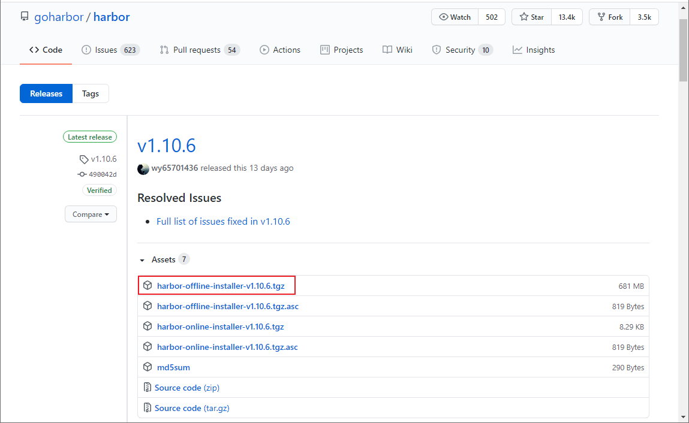
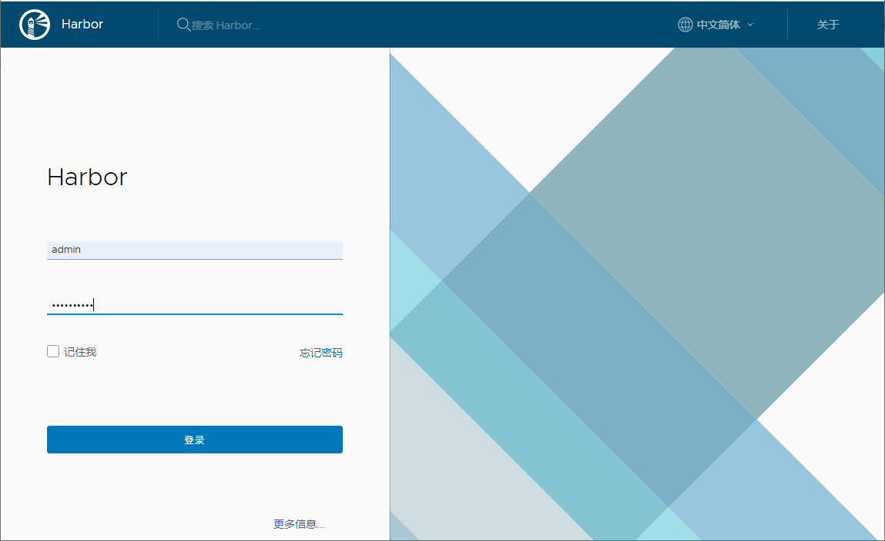
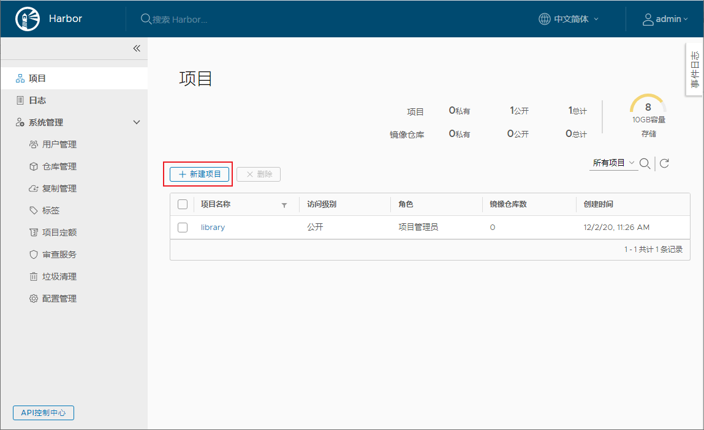
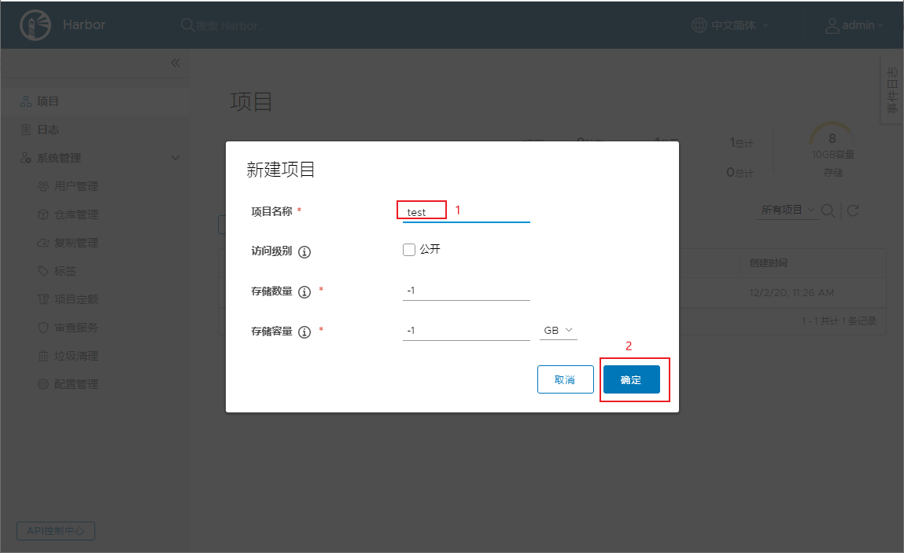
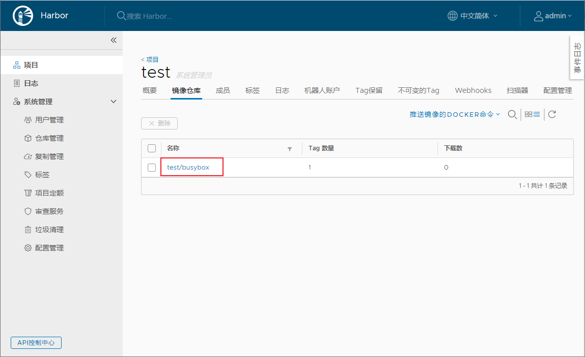
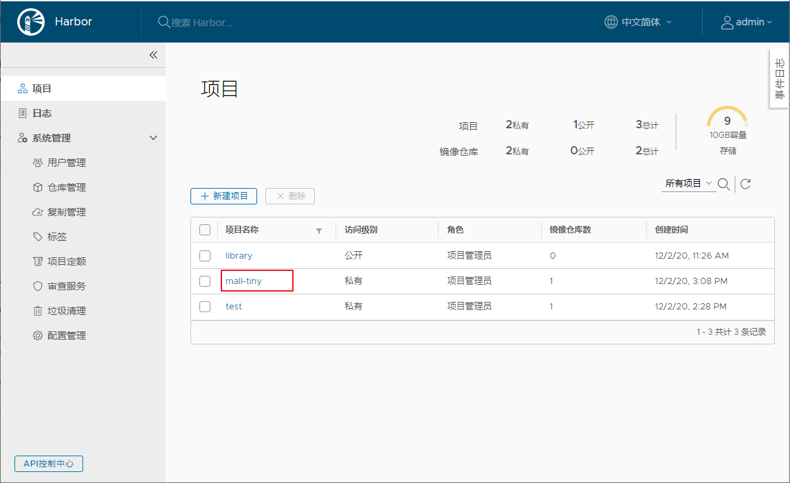
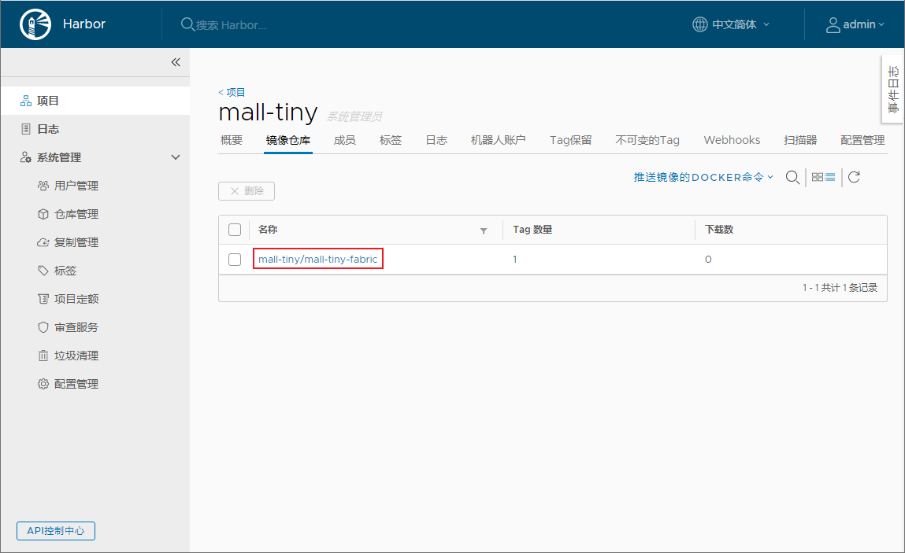

学习不走弯路，[关注公众号](#公众号) 回复「学习路线」，获取mall项目专属学习路线！

# DockerHub访问慢怎么破？自建个企业级镜像仓库试试！

> 平时经常用Docker来部署各种环境，发现从DockerHub上下载镜像有时候比较慢。第三方的镜像还可以使用一些国内的镜像仓库来加速，如果我们自己构建的镜像那就不行了。这时候搭建一个私有的镜像仓库很有必要，最近发现Harbor这个企业级镜像仓库，非常好用且功能强大，推荐给大家！

## Harbor简介

Harbor是一款开源的Docker镜像仓库服务，在Github上目前有13.4k+Star。提供了基于角色的镜像访问机制，可以保护你的镜像安全。

## 安装

> 学习开源项目的第一步，一般都是把它运行起来，我们先来把Harbor运行起来吧！

- 下载Harbor安装包，这里下载的是`v1.10.6`离线版本，下载地址：https://github.com/goharbor/harbor/releases



- 下载完成后上传到Linux服务器，使用如下命令解压；

```bash
tar xvf harbor-offline-installer-v1.10.6.tgz
```

- 解压完成后，所有文件内容如下；

```bash
[root@linux-local harbor]# ll
total 700260
drwxr-xr-x. 3 root root        20 Dec  2 11:18 common
-rw-r--r--. 1 root root      3398 Nov 17 11:58 common.sh
-rw-r--r--. 1 root root      5348 Dec  2 14:41 docker-compose.yml
-rw-r--r--. 1 root root 717021676 Nov 17 11:59 harbor.v1.10.6.tar.gz
-rw-r--r--. 1 root root      5882 Dec  2 11:21 harbor.yml
-rwxr-xr-x. 1 root root      2284 Nov 17 11:58 install.sh
-rw-r--r--. 1 root root     11347 Nov 17 11:58 LICENSE
-rwxr-xr-x. 1 root root      1749 Nov 17 11:58 prepare
```

- 修改Harbor的配置文件`harbor.yml`，修改`hostname`，并注释掉`https`配置，相关属性说明参考注释即可；

```yaml
# 指定Harbor的管理界面及镜像仓库访问地址
hostname: 192.168.3.101

# http相关配置
http:
  # http端口，如果配置了https，默认使用https
  port: 80

# https相关配置
#https:
#  # https端口
#  port: 443
#  # 指定Habor中Nginx的https的证书和私钥地址
#  certificate: /your/certificate/path
#  private_key: /your/private/key/path

# Harbor默认管理员账号admin的密码
harbor_admin_password: Harbor12345

# Harbor内置PostgreSQL数据库配置
database:
  # root用户密码
  password: 123456123
  # 最大空闲连接数，小于等于0表示无空闲连接
  max_idle_conns: 50
  # 最大连接数，小于等于0表示无限制
  max_open_conns: 100

# 默认数据目录
data_volume: /data

# Clair configuration
clair:
  # The interval of clair updaters, the unit is hour, set to 0 to disable the updaters.
  updaters_interval: 12

jobservice:
  # Maximum number of job workers in job service
  max_job_workers: 10

notification:
  # Maximum retry count for webhook job
  webhook_job_max_retry: 10

chart:
  # Change the value of absolute_url to enabled can enable absolute url in chart
  absolute_url: disabled

# 日志配置
log:
  # 日志级别配置： debug, info, warning, error, fatal
  level: info
  # 日志本地存储策略
  local:
    # 日志文件滚动数量，超过该数量会删除日志文件
    rotate_count: 50
    # 日志滚动大小，超过该大小会生成新的日志文件
    rotate_size: 200M
    # 日志存储路径
    location: /var/log/harbor

# This attribute is for migrator to detect the version of the .cfg file, DO NOT MODIFY!
_version: 1.10.0

# Configure proxies to be used by Clair, the replication jobservice, and Harbor. Leave blank if no proxies are required.
proxy:
  http_proxy:
  https_proxy:
  # no_proxy endpoints will appended to 127.0.0.1,localhost,.local,.internal,log,db,redis,nginx,core,portal,postgresql,jobservice,registry,registryctl,clair,chartmuseum,notary-server
  no_proxy:
  components:
    - core
    - jobservice
    - clair
```

- 使用`install.sh`脚本安装Harbor:

```bash
./install.sh
```

- Harbor启动成功后会输出如下信息，这里需要注意的是Harbor会启动Nginx、Redis之类的容器，以前创建过的需要先删除掉，看到`started successfully`就表示启动成功了；

```bash
[Step 0]: checking if docker is installed ...

Note: docker version: 19.03.5

[Step 1]: checking docker-compose is installed ...

Note: docker-compose version: 1.24.0

[Step 2]: loading Harbor images ...
Loaded image: goharbor/harbor-migrator:v1.10.6
Loaded image: goharbor/harbor-core:v1.10.6
Loaded image: goharbor/harbor-db:v1.10.6
Loaded image: goharbor/harbor-registryctl:v1.10.6
Loaded image: goharbor/nginx-photon:v1.10.6
Loaded image: goharbor/clair-photon:v1.10.6
Loaded image: goharbor/clair-adapter-photon:v1.10.6
Loaded image: goharbor/harbor-portal:v1.10.6
Loaded image: goharbor/harbor-log:v1.10.6
Loaded image: goharbor/registry-photon:v1.10.6
Loaded image: goharbor/notary-signer-photon:v1.10.6
Loaded image: goharbor/harbor-jobservice:v1.10.6
Loaded image: goharbor/redis-photon:v1.10.6
Loaded image: goharbor/prepare:v1.10.6
Loaded image: goharbor/notary-server-photon:v1.10.6
Loaded image: goharbor/chartmuseum-photon:v1.10.6


[Step 3]: preparing environment ...

[Step 4]: preparing harbor configs ...
prepare base dir is set to /mydata/harbor/harbor
WARNING:root:WARNING: HTTP protocol is insecure. Harbor will deprecate http protocol in the future. Please make sure to upgrade to https
Clearing the configuration file: /config/log/logrotate.conf
Clearing the configuration file: /config/log/rsyslog_docker.conf
Clearing the configuration file: /config/nginx/nginx.conf
Clearing the configuration file: /config/core/env
Clearing the configuration file: /config/core/app.conf
Clearing the configuration file: /config/registry/config.yml
Clearing the configuration file: /config/registry/root.crt
Clearing the configuration file: /config/registryctl/env
Clearing the configuration file: /config/registryctl/config.yml
Clearing the configuration file: /config/db/env
Clearing the configuration file: /config/jobservice/env
Clearing the configuration file: /config/jobservice/config.yml
Generated configuration file: /config/log/logrotate.conf
Generated configuration file: /config/log/rsyslog_docker.conf
Generated configuration file: /config/nginx/nginx.conf
Generated configuration file: /config/core/env
Generated configuration file: /config/core/app.conf
Generated configuration file: /config/registry/config.yml
Generated configuration file: /config/registryctl/env
Generated configuration file: /config/db/env
Generated configuration file: /config/jobservice/env
Generated configuration file: /config/jobservice/config.yml
loaded secret from file: /secret/keys/secretkey
Generated configuration file: /compose_location/docker-compose.yml
Clean up the input dir


Note: stopping existing Harbor instance ...
Stopping harbor-jobservice ... done
Stopping harbor-core       ... done
Stopping redis             ... done
Stopping registryctl       ... done
Stopping registry          ... done
Stopping harbor-db         ... done
Stopping harbor-portal     ... done
Stopping harbor-log        ... done
Removing harbor-jobservice ... done
Removing harbor-core       ... done
Removing redis             ... done
Removing registryctl       ... done
Removing registry          ... done
Removing harbor-db         ... done
Removing harbor-portal     ... done
Removing harbor-log        ... done
Removing network harbor_harbor


[Step 5]: starting Harbor ...
Creating network "harbor_harbor" with the default driver
Creating harbor-log ... done
Creating harbor-portal ... done
Creating registry      ... done
Creating harbor-db     ... done
Creating registryctl   ... done
Creating redis         ... done
Creating harbor-core   ... done
Creating harbor-jobservice ... done
Creating nginx             ... done
✔ ----Harbor has been installed and started successfully.----
```

- 我们可以使用`docker images`命令查看下安装Harbor安装的Docker镜像，还挺多的；

```bash
REPOSITORY                           TAG                 IMAGE ID            CREATED             SIZE                              latest              dc3bacd8b5ea        8 days ago          1.23MB
goharbor/chartmuseum-photon          v1.10.6             01b70eccaf71        2 weeks ago         178MB
goharbor/harbor-migrator             v1.10.6             a5d4a4ee44e4        2 weeks ago         356MB
goharbor/redis-photon                v1.10.6             99e25b65195c        2 weeks ago         132MB
goharbor/clair-adapter-photon        v1.10.6             aa72598ecc12        2 weeks ago         61.3MB
goharbor/clair-photon                v1.10.6             da1b03030e34        2 weeks ago         171MB
goharbor/notary-server-photon        v1.10.6             37c8bed3e255        2 weeks ago         142MB
goharbor/notary-signer-photon        v1.10.6             c56d82220929        2 weeks ago         139MB
goharbor/harbor-registryctl          v1.10.6             1d3986d90c65        2 weeks ago         101MB
goharbor/registry-photon             v1.10.6             3e669c8204ed        2 weeks ago         83.7MB
goharbor/nginx-photon                v1.10.6             a39d8dd46060        2 weeks ago         43.7MB
goharbor/harbor-log                  v1.10.6             1085d3865a57        2 weeks ago         106MB
goharbor/harbor-jobservice           v1.10.6             aa05538acecf        2 weeks ago         143MB
goharbor/harbor-core                 v1.10.6             193e76e6be5d        2 weeks ago         129MB
goharbor/harbor-portal               v1.10.6             942a9c448850        2 weeks ago         51.8MB
goharbor/harbor-db                   v1.10.6             37da2e5414ae        2 weeks ago         170MB
goharbor/prepare                     v1.10.6             35f073e33ec5        2 weeks ago         177MB
```

- 访问Harbor的管理界面，输入账号密码`admin:Harbor12345`登录即可，访问地址：http://192.168.3.101/



## 使用

> 接下来我们就可以使用Harbor来管理我们的镜像了。

- 首先点击`新建项目`按钮，新建一个项目：



- 这里新建一个叫做`test`的私有项目；



- 由于`docker login`命令默认不支持http访问，所以我们需要手动开启，使用Vim编辑器修改docker的配置文件`daemon.json`；

```bash
vi /etc/docker/daemon.json
```

- 添加一行`insecure-registries`配置即可，允许使用非安全方式访问Harbor镜像仓库，注意不要少了端口号`80`；

```json
{
 "registry-mirrors":["https://xxx.aliyuncs.com"],
 "insecure-registries":["192.168.3.101:80"]
}
```

- 再次重新启动docker服务；

```bash
systemctl restart docker
```

- 再次使用`install.sh`启动Harbor服务；

```bash
./install.sh
```

- 使用`docker login`命令访问Harbor镜像仓库，注意加上端口号为`80`；

```bash
[root@linux-local harbor]# docker login 192.168.3.101:80
Username: admin
Password: 
WARNING! Your password will be stored unencrypted in /root/.docker/config.json.
Configure a credential helper to remove this warning. See
https://docs.docker.com/engine/reference/commandline/login/#credentials-store

Login Succeeded
```

- 编写Dockerfile脚本，用于构建Docker镜像，一个最简单的busybox脚本如下；

```dockerfile
FROM busybox:latest
```

- 使用如下命令构建一个自己的busybox镜像；

```bash
docker build -t 192.168.3.101:80/test/busybox .
```

- 将自己构建的busybox镜像推送到Harbor镜像仓库；

```bash
docker push 192.168.3.101:80/test/busybox
```

- 推送成功后在Harbor的管理界面中就可以查看到busybox镜像了；



- 由于Harbor是用Docker Compose部署的，可以直接使用Docker Compose的命令来停止和启动。

```bash
# 停止Harbor
docker-compose stop
# 启动Harbor
docker-compose start
```

## 结合SpringBoot使用

> 这里使用之前的`mall-tiny-fabric`项目来演示下，如何使用Maven插件一键打包并推送到Harbor镜像仓库。

- 首先修改项目的`pom.xml`文件，修改推送的`镜像仓库地址`，并添加`认证信息`即可；

```xml
<plugin>
     <groupId>io.fabric8</groupId>
     <artifactId>docker-maven-plugin</artifactId>
     <version>0.33.0</version>
     <executions>
         <!--如果想在项目打包时构建镜像添加-->
         <execution>
             <id>build-image</id>
             <phase>package</phase>
             <goals>
                 <goal>build</goal>
             </goals>
         </execution>
     </executions>
     <configuration>
         <!-- Docker 远程管理地址-->
         <dockerHost>http://192.168.3.101:2375</dockerHost>
         <!-- Docker 推送镜像仓库地址-->
         <pushRegistry>http://192.168.3.101:80</pushRegistry>
         <!-- 认证信息-->
         <authConfig>
             <push>
                 <username>admin</username>
                 <password>Harbor12345</password>
             </push>
         </authConfig>
         <images>
             <image>
                 <!--由于推送到私有镜像仓库，镜像名需要添加仓库地址-->
                 <name>192.168.3.101:80/mall-tiny/${project.name}:${project.version}</name>
                 <!--定义镜像构建行为-->
                 <build>
                     <!--定义基础镜像-->
                     <from>java:8</from>
                     <args>
                         <JAR_FILE>${project.build.finalName}.jar</JAR_FILE>
                     </args>
                     <!--定义哪些文件拷贝到容器中-->
                     <assembly>
                         <!--定义拷贝到容器的目录-->
                         <targetDir>/</targetDir>
                         <!--只拷贝生成的jar包-->
                         <descriptorRef>artifact</descriptorRef>
                     </assembly>
                     <!--定义容器启动命令-->
                     <entryPoint>["java", "-jar","/${project.build.finalName}.jar"]</entryPoint>
                     <!--定义维护者-->
                     <maintainer>macrozheng</maintainer>
                     <!--使用Dockerfile构建时打开-->
                     <!--<dockerFileDir>${project.basedir}</dockerFileDir>-->
                 </build>
                 <!--定义容器启动行为-->
                 <run>
                     <!--设置容器名，可采用通配符-->
                     <containerNamePattern>${project.artifactId}</containerNamePattern>
                     <!--设置端口映射-->
                     <ports>
                         <port>8080:8080</port>
                     </ports>
                     <!--设置容器间连接-->
                     <links>
                         <link>mysql:db</link>
                     </links>
                     <!--设置容器和宿主机目录挂载-->
                     <volumes>
                         <bind>
                             <volume>/etc/localtime:/etc/localtime</volume>
                             <volume>/mydata/app/${project.artifactId}/logs:/var/logs</volume>
                         </bind>
                     </volumes>
                 </run>
             </image>
         </images>
     </configuration>
</plugin>
```

- 推送镜像之前需要在Harbor中创建好`mall-tiny`项目，否则会无法推送镜像；



- 之后使用Maven插件打包镜像并推送到Harbor仓库，具体可以参考[《还在手动部署SpringBoot应用？试试这个自动化插件！》](https://mp.weixin.qq.com/s/3X6vVdWmjmWCyiLm35jpVw)，推送过程中输出信息如下；

```bash
[INFO] Scanning for projects...
[INFO]                                                                         
[INFO] ------------------------------------------------------------------------
[INFO] Building mall-tiny-fabric 0.0.1-SNAPSHOT
[INFO] ------------------------------------------------------------------------
[INFO] 
[INFO] --- docker-maven-plugin:0.33.0:push (default-cli) @ mall-tiny-fabric ---

[INFO] DOCKER> The push refers to repository [192.168.3.101:80/mall-tiny/mall-tiny-fabric]
###############
[INFO] DOCKER> 0.0.1-SNAPSHOT: digest: sha256:3a54682fd3b04526f6da0916e98f3d0d5ba4193a8ad6aafbe6c05a1badf6c13b size: 2212

[INFO] DOCKER> Temporary image tag skipped. Target image '192.168.3.101:80/mall-tiny/mall-tiny-fabric:0.0.1-SNAPSHOT' already has registry set or no registry is available
[INFO] DOCKER> Pushed 192.168.3.101:80/mall-tiny/mall-tiny-fabric:0.0.1-SNAPSHOT in 2 minutes and 8 seconds 
[INFO] ------------------------------------------------------------------------
[INFO] BUILD SUCCESS
[INFO] ------------------------------------------------------------------------
[INFO] Total time: 02:11 min
[INFO] Finished at: 2020-12-02T15:11:10+08:00
[INFO] Final Memory: 19M/219M
[INFO] ------------------------------------------------------------------------

Process finished with exit code 0
```

- 打开Harbor管理页面，发现`mall-tiny-fabric`镜像已经存在了。



## 总结

Harbor提供了管理界面让我们可以更方便地管理Docker镜像，同时添加了基于角色的权限管理功能来保护镜像的安全。之前我们为了安全地使用镜像，需要使用繁琐的TLS来控制远程Docker服务打包镜像，具体参考[《Docker服务开放了这个端口，服务器分分钟变肉机！》](https://mp.weixin.qq.com/s/3d5IlLcyklVsGDOqeipIYw)。现在我们只要搭建一个Harbor镜像仓库，然后本地打包好镜像上传到Harbor，需要使用镜像的时候直接从Harbor下载即可！

## 参考资料

官方文档：https://goharbor.io/docs/2.1.0/install-config/

## 项目源码地址

https://github.com/macrozheng/mall-learning/tree/master/mall-tiny-fabric

## 公众号

